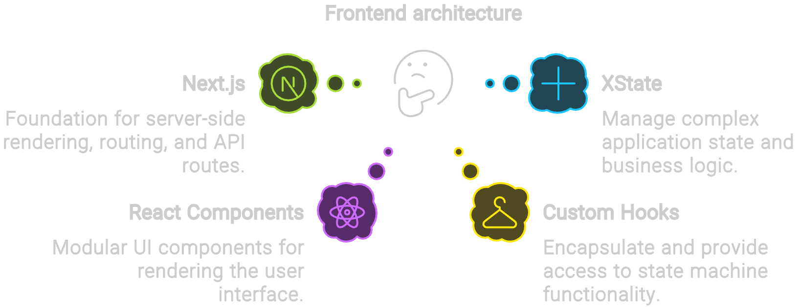
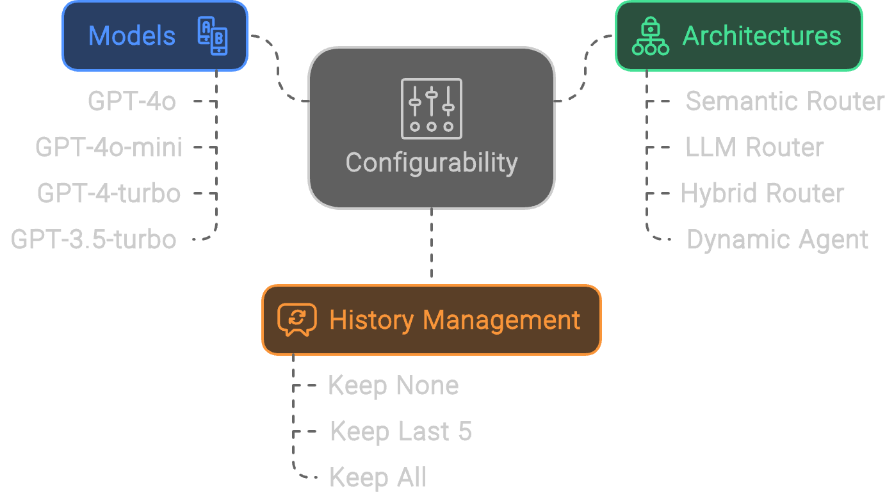
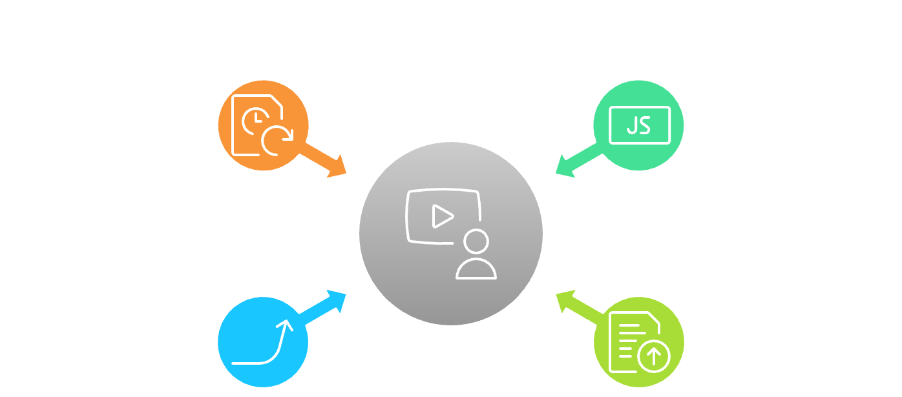

# BoardBot Dev Frontend

## Overview

BoardBot is an AI-powered system designed to assist users with queries about computer hardware products, particularly focusing on embedded systems, development kits, and industrial communication devices. This frontend application streamlines and automates the testing process for the BoardBot system and manages the products in the BoardBot database. Built with Next.js, XState 5, and TypeScript, it provides a robust, type-safe, and state-driven approach to handling complex workflows.



## Table of Contents

1. [Features](#features)
2. [Project Structure](#project-structure)
3. [Usage](#usage)
4. [Setup and Installation](#setup-and-installation)
5. [Configuration](#configuration)
6. [Contributing](#contributing)
7. [License](#license)

## Features

### Configurability



The application offers various configuration options to tailor the BoardBot system's behavior:

- **Models**:

  - GPT-4o
  - GPT-4o-mini
  - GPT-4-turbo
  - GPT-3.5-turbo

- **Architectures**:

  - Semantic Router
  - LLM Router
  - Hybrid Router
  - Dynamic Agent

- **History Management**:
  - Keep None: No chat history is maintained
  - Keep Last 5: Retains the last 5 exchanges
  - Keep All: Maintains the entire conversation history

### State Persistence



The application provides robust state management capabilities:

- Export the full system state to a JSON file
- Import a previously exported full system state
- Export specific experiment results for further analysis
- Automatic state saving to local storage every 30 seconds

### Chat

The chat feature allows developers to interact with the BoardBot system as an end-user would. It provides:

- Real-time conversation with the AI
- Comprehensive details about token usage, time steps, and costs at each pipeline stage
- Configurable model, architecture, and history management options

### Testing

The testing module supports two types of tests:

1. **Accuracy Tests**: Evaluate the AI's ability to correctly identify and describe products.
2. **Consistency Tests**: Assess the AI's consistency in responses across similar prompts.

Key features include:

- Batch test execution
- Real-time progress tracking
- Detailed results display, including product and feature accuracy metrics
- Ability to pause, resume, and retry failed tests

#### Test Case Format

Test cases should be provided in JSON format. The format differs slightly for accuracy and consistency tests:

##### Accuracy Test Format

```json
[
  {
    "prompt": "What are the available Computers on Module (COM) with DDR4 memory support and comes with an Intel processor?",
    "products": [
      {
        "name": "SOM Intel 11th Gen Core Processors",
        "ids": "SOM-5883D4R-U4A1",
        "manufacturer": "Advantech",
        "form_factor": "COM Express Basic Module",
        "processor": "Intel Xeon/Core",
        "core_count": "Hexa/Quad",
        "processor_tdp": "Up to 45W",
        "memory": "Dual channel DDR4, Max 128GB, ECC optional",
        "io": "USB 3.1 Gen2, PCIe x16 Gen3, SATA Gen3, Three Independent Displays, Ethernet, Audio, Serial, GPIO, SPI, CAN Bus",
        "operating_system": "Windows 10 IoT Enterprise LTSB, Windows 10 IoT Enterprise LTSB 64-bit",
        "environmentals": "Operating Temperature: 0°C to 60°C, Extended Temperature: -40°C to 85°C, Storage Temperature: -40°C to 85°C, Humidity: 95% relative humidity non-condensing",
        "certifications": "Military-grade"
      },
      {
        "name": "Intel Core i7-10700K",
        "ids": "10700K",
        "manufacturer": "Intel",
        "form_factor": "COM Express Basic",
        "processor": "Intel Core i7-10700K",
        "core_count": "Hexa",
        "processor_tdp": "Up to 45W",
        "memory": "Dual channel DDR4, Max 128GB, ECC optional",
        "io": "USB 3.1 Gen2, PCIe x16 Gen3, SATA Gen3, Three Independent Displays, Ethernet, Audio, Serial, GPIO, SPI, CAN Bus",
        "operating_system": "Windows 10 IoT Enterprise LTSB, Windows 10 IoT Enterprise LTSB 64-bit",
        "environmentals": "Operating Temperature: 0°C to 60°C, Extended Temperature: -40°C to 85°C, Storage Temperature: -40°C to 85°C, Humidity: 95% relative humidity non-condensing",
        "certifications": "Military-grade"
      }
    ]
  }
]
```

##### Consistency Test Format

```json
[
  {
    "prompt": "List Single Board Computers with a processor frequency of 1.5 GHz or higher and manufactured by Broadcom",
    "variations": [
      "List Single Board Computers with a processor frequency of 1.5 GHz or higher and manufactured by Broadcom",
      "Enumerate Broadcom-made SBCs featuring processors running at 1.5 GHz or above",
      "Show Single Board Computers from Broadcom with CPU speeds of at least 1.5 GHz",
      "Provide a list of Broadcom SBCs with processors clocked at 1.5 GHz or faster",
      "Display Single Board Computers manufactured by Broadcom with CPU frequencies of 1.5 GHz and higher"
    ]
  },
  {
    "prompt": "What are the available Computers on Module (COM) with DDR4 memory support and comes with an Intel processor?",
    "variations": [
      "What are the available Computers on Module (COM) with DDR4 memory support and comes with an Intel processor?",
      "List COMs featuring Intel CPUs and DDR4 memory compatibility",
      "Show Computers on Module that have Intel processors and support DDR4 RAM",
      "Enumerate Intel-based COMs with DDR4 memory support",
      "Display available Computers on Module equipped with Intel CPUs and DDR4 memory capabilities"
    ]
  }
]
```

When creating test cases, ensure that:

- For accuracy tests, each prompt is accompanied by the expected products.
- For consistency tests, each prompt has multiple variations that are semantically similar but phrased differently.

### Product Management

The product management feature allows users to:

- View a paginated list of products
- Add new products (individually or in bulk)
- Update existing products
- Delete products
- Filter and search products

## Project Structure

The project follows a modular structure:

```
/
├── app/             # Next.js app router
├── components/      # Reusable React components
├── context/         # React context providers
├── hooks/           # Custom React hooks
├── lib/             # Utility functions and helpers
├── machines/        # XState machine definitions
├── public/          # Static assets
├── styles/          # CSS and styling files
├── types/           # TypeScript type definitions
└── README.md        # Project documentation
```

## Usage

### Chat

1. Navigate to the Chat section.
2. Select the desired model, architecture, and history management option from the dropdown menus.
3. Type your message in the input field and press enter or click the send button.
4. View the AI's response in the chat window, along with performance metrics.

### Testing

1. Go to the Testing section.
2. Upload your test cases in JSON format (see [Test Case Format](#test-case-format) for details).
3. Click "Create Test" to initiate a new test.
4. Select the created test from the list and click "Run Test".
5. Monitor the progress bar and real-time statistics as tests are executed.
6. Once complete, view the detailed results, including accuracy and consistency metrics.

### Product Management

1. Access the Product Management section.
2. View the list of products on the main page.
3. Use the search bar and filter options to find specific products.
4. Click on a product to view details or edit.
5. Use the "Add Product" button to add new products individually or in bulk.
6. To update a product, click the edit button on the product details page.
7. To delete a product, use the delete option on the product details page.

## Setup and Installation

### Prerequisites

- Node.js (v14.0.0 or later)
- npm (v6.0.0 or later)

### Installation Steps

1. Clone the repository:

   ```
   git clone https://github.com/get10acious/ThroughPut
   cd ThroughPut/frontend
   ```

2. Install dependencies:

   ```
   bun install
   ```

3. Set up environment variables: Create a `.env.local` file in the root directory and add the following:

   ```
   NEXT_PUBLIC_SOCKET_URL=your_websocket_server_url
   ```

4. Start the development server:

   ```
   bun run dev
   ```

5. Open your browser and navigate to `http://localhost:3000` (or the port specified by Next.js).

## Configuration

The application uses XState for state management. The main app machine (`appMachine.ts`) orchestrates the overall application state, while individual feature machines (`chatMachine.ts`, `testMachine.ts`, `productMachine.ts`) handle specific functionality.

To modify the behavior of these state machines, edit the corresponding files in the `machines/` directory.

## Contributing

1. Fork the repository
2. Create your feature branch (`git checkout -b feature/AmazingFeature`)
3. Commit your changes (`git commit -m 'Add some AmazingFeature'`)
4. Push to the branch (`git push origin feature/AmazingFeature`)
5. Open a Pull Request

Please ensure that your code adheres to the existing style conventions and includes appropriate tests.

## License

This project is licensed under the MIT License - see the [LICENSE](LICENSE) file for details.
